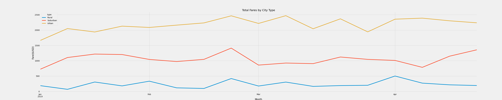

# PyBer Analysis
A ridesharing analysis and visualization of PyBer rides Jan-Apr 2019

### Overview of the analysis:
The purpose of this visualization is to explore any potential disparities between PyBer fares in different population types.

### Results:
\
Presented first and foremost is our final analysis: the above is a contrasting visualization of fare cost by city type over the course of several weeks, which shows a consistent trend for each fare type. It's clear from these results that urban cities consistently bring in more fares than suburban, which in turn bring in more than rural cities. The comparative trends show little correlation week to week, each city type increasing and decreasing total fare revenues without much impact on the others.

However, reviewing some of our data shows an interesting disparity highlighted in the below chart:
\
Do you see how much higher the cost is for a rural PyBer than it is for an urban one? It is also worth noting here that the amount of drivers available in rural areas is much lower than in urban areas, likely leading to inflation in those areas.

### Summary:
Based on the above analysis, I would make the following recommendations:
1. *To improve fares in rural areas:* The fares in rural areas could potentially be prohibitively expensive for new customers. Condsider price equalization if it is not already in place in order to make rates more approachable. To draw more drivers in, consider mileage reibursement, to offset the increased distances in rural areas. Normalize and publicize ridesharing to help it enter the common rural parlance.
2. *To improve fares in urban areas:* See the above "Fare per Driver" chart for evidence that there are too many drivers in urban cities. Consider limiting the pool of available drivers to bring up demand and to add value to the PyBer brand. 
3. **Consider a commute of urban drivers to rural areas.** This should bring up the fares in rural areas and allow drivers to better thrive in urban areas by creating a more competitive environment.
